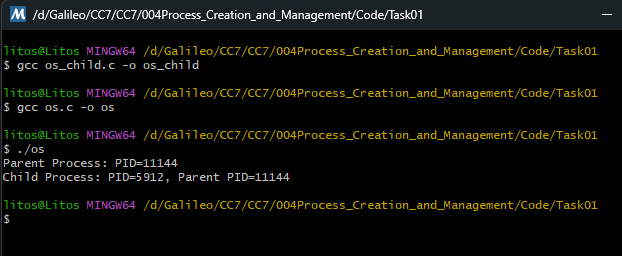

# Task 01 – Creating a New Process

Program that spawns a child process, and both parent and child print messages.

### Explanation of the code

- `STARTUPINFO`: Describe how the child process is started.
- `PROCESS_INFORMATION`: receive information from the process created
- `ZeroMemory`: Structures are initialized to zero to avoid memory garbage.
- `DWORD`: Integer data type defined by the Windows API, Double WORD
- `snprintf(cmdLine, sizeof(cmdLine), "os_child.exe %lu", ppid)`: String concatenation passed through the cmd., the parent PID is sent as a parameter.
- `CreateProcessA` Creates a new child process and starts its execution.
- `CloseHandle` Releases the handles of the child process; this does not terminate the process, it only releases resources from the parent.
-  `DWORD ppid = strtoul(argv[1], NULL, 10)` Convert text (string) to a base 10 integer, strtoul = string to unsigned long

### Output

