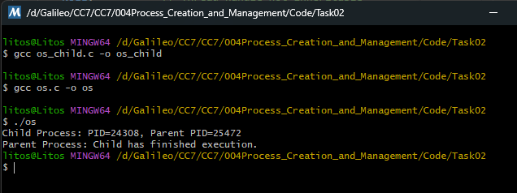

# Task 02 – Synchronizing Parent and Child Process

Modify the program so the parent waits for the child to finish execution

### Explanation of the code

Same code base as Task 01.

- `WaitForSingleObject`: Forces the parent process to wait until the child process finishes execution.

- `INFINITE`: The parent waits with no time limit.

### Output

