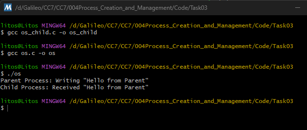

# Task 03 – Inter-Process Communication Using Pipes

Establish a one-way communication channel between parent and child using a 
pipe. 

### Explanation of the code

- `CreatePipe()`: Creates pipe with a read end and a write end.

- `SECURITY_ATTRIBUTES` with `bInheritHandle = TRUE` Allows the child process to inherit the pipe handles.

- `SetHandleInformation()`: Prevents the child from inheriting the write end of the pipe. The child should only read.

- `STARTUPINFO`: with `STARTF_USESTDHANDLES` Redirects the child’s `STDIN` to the read end of the pipe.

- `WriteFile()`: The parent writes the message `"Hello from Parent"` into the pipe.

- `CloseHandle(hWritePipe)`: Signals end-of-file to the child process.

- `GetStdHandle(STD_INPUT_HANDLE)`: Retrieves the redirected standard input (the pipe).

- `ReadFile()`: Reads the message sent by the parent process

### Output
