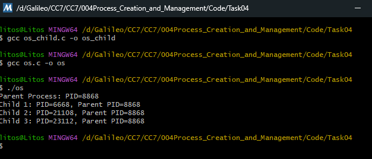

# Task 04 – Creating Multiple Child Processes

Modify the program to spawn multiple child processes

### Explanation of the code

- `#define NUM_CHILDREN 3`: Defines how many child processes will be created.

- `PROCESS_INFORMATION pi[NUM_CHILDREN]`: Stores process and thread handles for each child.

Then it is the same base code as tasks 1 and 2.

### Output
