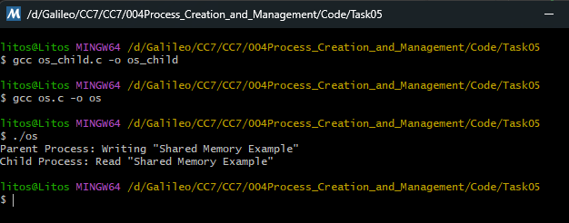

# Task 05 – Shared Memory (Advanced Task)

 Implement shared memory for communication between processes.

 ### Explanation of the code
 
- `CreateFileMappingA()`: Creates a shared memory object backed by the system paging file. `INVALID_HANDLE_VALUE` indicates system memory (not a real file). `SHM_NAME` is the shared memory identifier. `SHM_SIZE` defines the size of the shared memory region.

- `MapViewOfFile()` Maps the shared memory object into the parent process’s virtual address space.
 
- `CopyMemory()`: Writes the message `"Shared Memory Example"` directly into the shared memory region.

- Cleanup: `UnmapViewOfFile()`, `CloseHandle()`

- `OpenFileMappingA()` Opens the existing shared memory object created by the parent.

- `MapViewOfFile()`: Maps the same shared memory region into the child process’s address space.

- Reads and prints the message directly from shared memory.

- Cleanup: `UnmapViewOfFile()`, `CloseHandle()`

### Output
